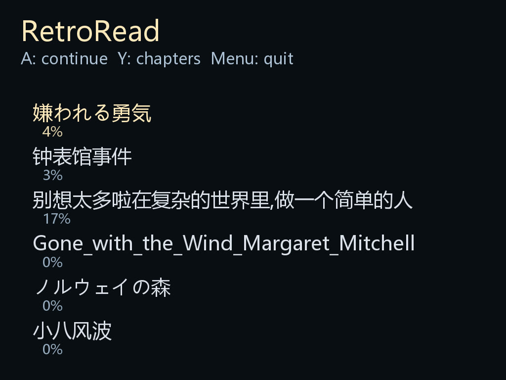
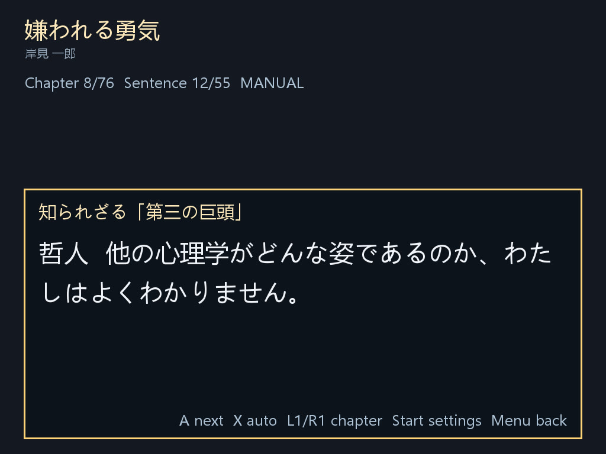
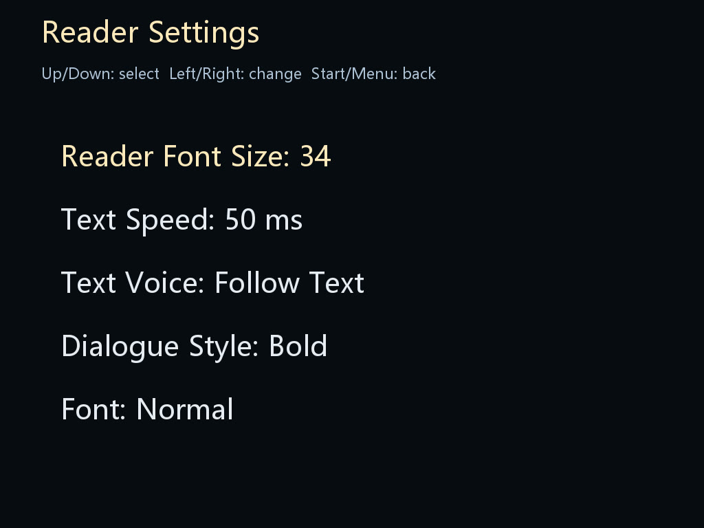

# RetroRead-Pak

RetroRead is a game-like dialogue-style reader Pak for TrimUI NextUI. It aims to make reading feel closer to playing through story scenes in a retro game.

RetroRead supports `.epub` and `.txt` books, remembers your reading progress, and presents text in a dialogue-box style designed for handheld play.

| Bookshelf | Reading | Settings |
| --- | --- | --- |
|  |  |  |

## Install

1. Download the latest release from this repository.
2. Extract the release archive.
3. Copy the entire `RetroRead.pak` folder to your SD card:

```text
SD_ROOT/Tools/tg5040/RetroRead.pak
```

4. Reinsert the SD card into your device.
5. Launch `RetroRead` from the `Tools` menu in NextUI.

## Add Books

Put your books into the `Books` directory inside the Pak or into the Books folder your device setup already uses. RetroRead can read:

- `.epub`
- `.txt`

## Controls

- `A`: next / confirm / fast reveal
- `B`: previous sentence
- `Y`: chapters
- `L1` / `R1`: previous / next chapter
- `Start`: settings
- `Menu`: back / quit

## Features

- Dialogue-style reading inspired by retro game text boxes
- EPUB and TXT support
- Per-book reading progress
- Adjustable text speed
- Optional text voice effects
- Multiple dialogue box styles
- Reading settings tuned for handheld screens
